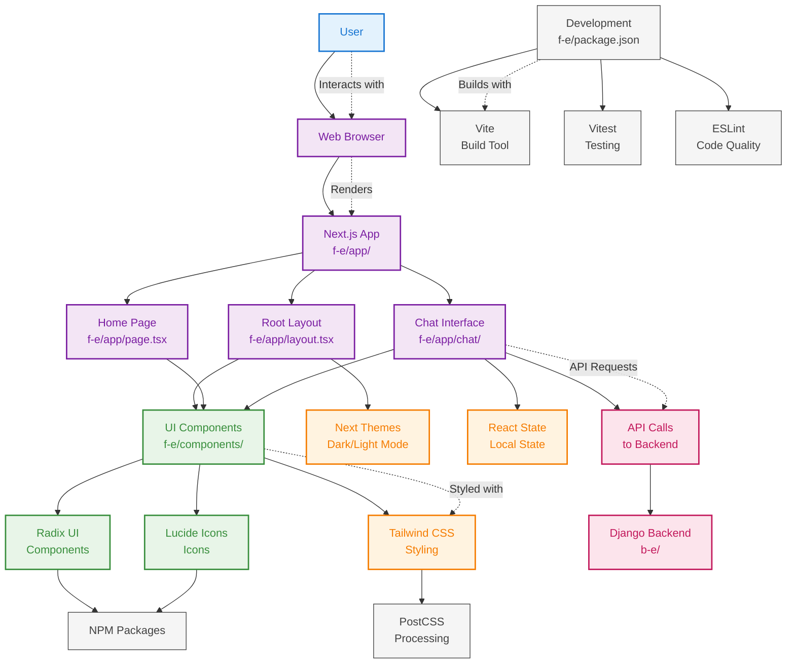

```mermaid
graph TB
    %% User Interface
    USER["User"] --> BROWSER["Web Browser"]

    %% Next.js Application
    BROWSER --> APP["Next.js App<br/>f-e/app/"]

    %% App Router Structure
    APP --> LAYOUT["Root Layout<br/>f-e/app/layout.tsx"]
    APP --> PAGE["Home Page<br/>f-e/app/page.tsx"]
    APP --> CHAT["Chat Interface<br/>f-e/app/chat/"]

    %% Components
    LAYOUT --> COMPONENTS["UI Components<br/>f-e/components/"]
    PAGE --> COMPONENTS
    CHAT --> COMPONENTS

    COMPONENTS --> RADIX["Radix UI<br/>Components"]
    COMPONENTS --> LUCIDE["Lucide Icons<br/>Icons"]

    %% Styling & Theming
    COMPONENTS --> TAILWIND["Tailwind CSS<br/>Styling"]
    LAYOUT --> THEMES["Next Themes<br/>Dark/Light Mode"]

    %% State Management
    CHAT --> STATE["React State<br/>Local State"]

    %% API Communication
    CHAT --> API_CALLS["API Calls<br/>to Backend"]
    API_CALLS --> BACKEND["Django Backend<br/>b-e/"]

    %% Build & Development
    DEV["Development<br/>f-e/package.json"] --> VITE["Vite<br/>Build Tool"]
    DEV --> VITEST["Vitest<br/>Testing"]
    DEV --> ESLINT["ESLint<br/>Code Quality"]

    %% External Dependencies
    RADIX --> NPM["NPM Packages"]
    LUCIDE --> NPM
    TAILWIND --> POSTCSS["PostCSS<br/>Processing"]

    %% Styling
    classDef user fill:#e3f2fd,stroke:#1976d2,stroke-width:2px,color:#1976d2
    classDef ui fill:#f3e5f5,stroke:#7b1fa2,stroke-width:2px,color:#7b1fa2
    classDef components fill:#e8f5e8,stroke:#388e3c,stroke-width:2px,color:#388e3c
    classDef styling fill:#fff3e0,stroke:#f57c00,stroke-width:2px,color:#f57c00
    classDef data fill:#fce4ec,stroke:#c2185b,stroke-width:2px,color:#c2185b
    classDef dev fill:#f5f5f5,stroke:#424242,stroke-width:1px,color:#424242

    class USER user
    class BROWSER,APP,LAYOUT,PAGE,CHAT ui
    class COMPONENTS,RADIX,LUCIDE components
    class TAILWIND,THEMES,STATE styling
    class API_CALLS,BACKEND data
    class DEV,VITE,VITEST,ESLINT,NPM,POSTCSS dev

    %% Flow Labels
    USER -.->|"Interacts with"| BROWSER
    BROWSER -.->|"Renders"| APP
    CHAT -.->|"API Requests"| API_CALLS
    COMPONENTS -.->|"Styled with"| TAILWIND
    DEV -.->|"Builds with"| VITE
```