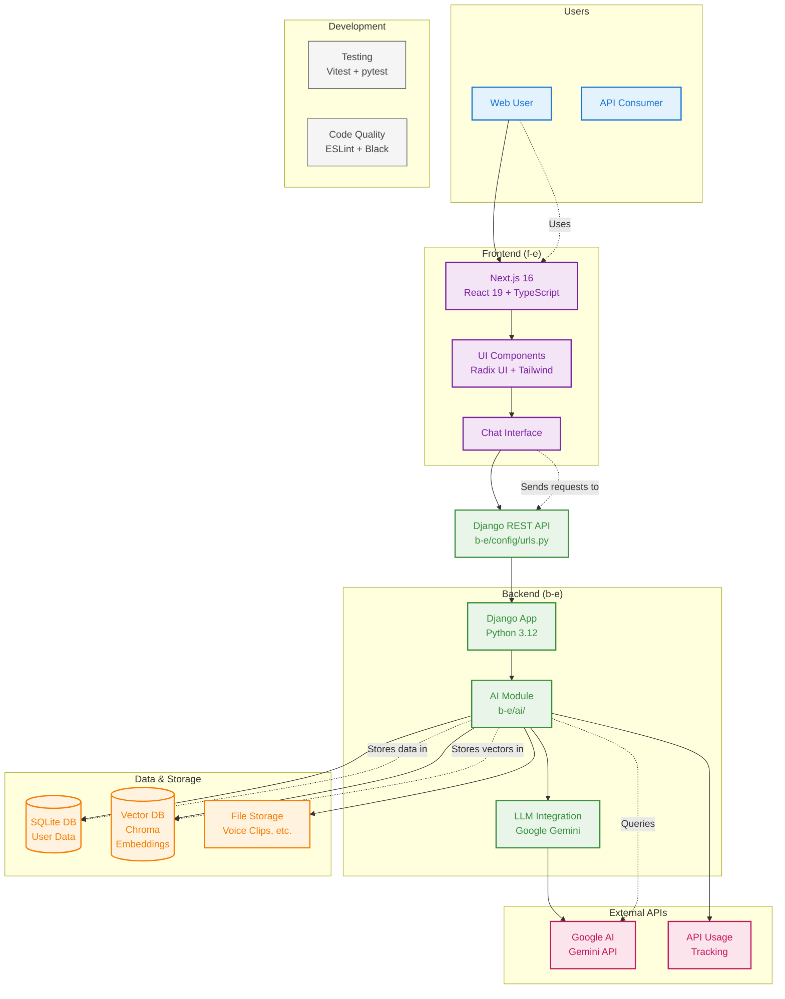

```mermaid
graph TB
    %% Users
    subgraph "Users"
        WEB_USER["Web User"]
        API_USER["API Consumer"]
    end

    %% Frontend Layer
    subgraph "Frontend (f-e)"
        NEXT["Next.js 16<br/>React 19 + TypeScript"]
        UI["UI Components<br/>Radix UI + Tailwind"]
        CHAT_UI["Chat Interface"]
    end

    %% Communication
    WEB_USER --> NEXT
    NEXT --> UI
    UI --> CHAT_UI

    %% API Gateway
    CHAT_UI --> DJANGO_API["Django REST API<br/>b-e/config/urls.py"]

    %% Backend Layer
    subgraph "Backend (b-e)"
        DJANGO["Django App<br/>Python 3.12"]
        AI_MODULE["AI Module<br/>b-e/ai/"]
        LLM_INTEGRATION["LLM Integration<br/>Google Gemini"]
    end

    %% Backend Flow
    DJANGO_API --> DJANGO
    DJANGO --> AI_MODULE
    AI_MODULE --> LLM_INTEGRATION

    %% Data Layer
    subgraph "Data & Storage"
        SQLITE[("SQLite DB<br/>User Data")]
        VECTOR_DB[("Vector DB<br/>Chroma<br/>Embeddings")]
        FILE_STORAGE["File Storage<br/>Voice Clips, etc."]
    end

    %% Data Connections
    AI_MODULE --> SQLITE
    AI_MODULE --> VECTOR_DB
    AI_MODULE --> FILE_STORAGE

    %% External Services
    subgraph "External APIs"
        GOOGLE_AI["Google AI<br/>Gemini API"]
        API_USAGE["API Usage<br/>Tracking"]
    end

    %% External Connections
    LLM_INTEGRATION --> GOOGLE_AI
    AI_MODULE --> API_USAGE

    %% Development Tools
    subgraph "Development"
        TESTING["Testing<br/>Vitest + pytest"]
        LINTING["Code Quality<br/>ESLint + Black"]
    end

    %% Styling
    classDef user fill:#e3f2fd,stroke:#1976d2,stroke-width:2px,color:#1976d2
    classDef frontend fill:#f3e5f5,stroke:#7b1fa2,stroke-width:2px,color:#7b1fa2
    classDef backend fill:#e8f5e8,stroke:#388e3c,stroke-width:2px,color:#388e3c
    classDef data fill:#fff3e0,stroke:#f57c00,stroke-width:2px,color:#f57c00
    classDef external fill:#fce4ec,stroke:#c2185b,stroke-width:2px,color:#c2185b
    classDef dev fill:#f5f5f5,stroke:#424242,stroke-width:1px,color:#424242

    class WEB_USER,API_USER user
    class NEXT,UI,CHAT_UI frontend
    class DJANGO,DJANGO_API,AI_MODULE,LLM_INTEGRATION backend
    class SQLITE,VECTOR_DB,FILE_STORAGE data
    class GOOGLE_AI,API_USAGE external
    class TESTING,LINTING dev

    %% Flow Labels
    WEB_USER -.->|"Uses"| NEXT
    CHAT_UI -.->|"Sends requests to"| DJANGO_API
    AI_MODULE -.->|"Queries"| GOOGLE_AI
    AI_MODULE -.->|"Stores data in"| SQLITE
    AI_MODULE -.->|"Stores vectors in"| VECTOR_DB
```