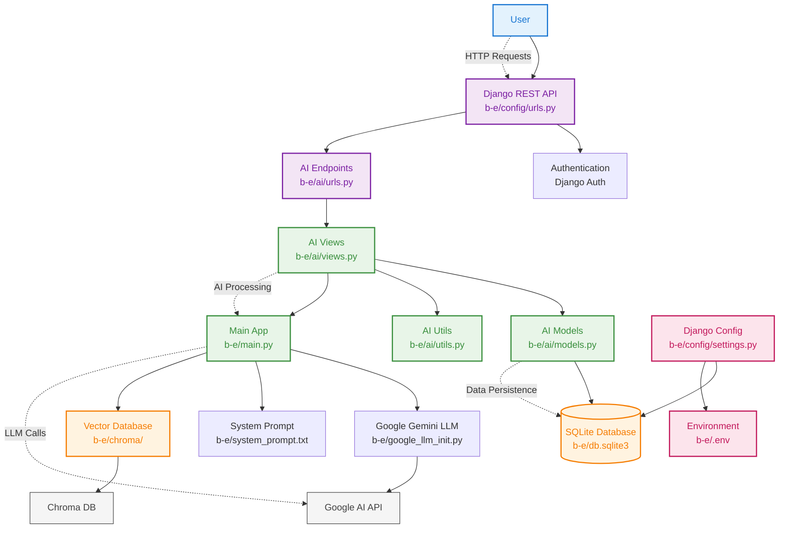

```mermaid
graph TB
    %% User Interaction
    USER["User"] --> API["Django REST API<br/>b-e/config/urls.py"]

    %% API Layer
    API --> AUTH["Authentication<br/>Django Auth"]
    API --> AI_API["AI Endpoints<br/>b-e/ai/urls.py"]

    %% Business Logic
    AI_API --> AI_VIEWS["AI Views<br/>b-e/ai/views.py"]
    AI_VIEWS --> AI_MODELS["AI Models<br/>b-e/ai/models.py"]
    AI_VIEWS --> AI_UTILS["AI Utils<br/>b-e/ai/utils.py"]

    %% Core Application
    AI_VIEWS --> MAIN["Main App<br/>b-e/main.py"]
    MAIN --> LLM["Google Gemini LLM<br/>b-e/google_llm_init.py"]
    MAIN --> SYS_PROMPT["System Prompt<br/>b-e/system_prompt.txt"]

    %% Data Layer
    AI_MODELS --> DB[("SQLite Database<br/>b-e/db.sqlite3")]
    MAIN --> VECTOR_DB["Vector Database<br/>b-e/chroma/"]

    %% Configuration
    CONFIG["Django Config<br/>b-e/config/settings.py"] --> DB
    CONFIG --> ENV["Environment<br/>b-e/.env"]

    %% External Services
    LLM --> GOOGLE["Google AI API"]
    VECTOR_DB --> CHROMA["Chroma DB"]

    %% Styling
    classDef user fill:#e3f2fd,stroke:#1976d2,stroke-width:2px,color:#1976d2
    classDef api fill:#f3e5f5,stroke:#7b1fa2,stroke-width:2px,color:#7b1fa2
    classDef business fill:#e8f5e8,stroke:#388e3c,stroke-width:2px,color:#388e3c
    classDef data fill:#fff3e0,stroke:#f57c00,stroke-width:2px,color:#f57c00
    classDef config fill:#fce4ec,stroke:#c2185b,stroke-width:2px,color:#c2185b
    classDef external fill:#f5f5f5,stroke:#424242,stroke-width:1px,color:#424242

    class USER user
    class API,AI_API api
    class AI_VIEWS,AI_MODELS,AI_UTILS,MAIN business
    class DB,VECTOR_DB data
    class CONFIG,ENV config
    class GOOGLE,CHROMA external

    %% Flow Labels
    USER -.->|"HTTP Requests"| API
    AI_VIEWS -.->|"AI Processing"| MAIN
    MAIN -.->|"LLM Calls"| GOOGLE
    AI_MODELS -.->|"Data Persistence"| DB
```